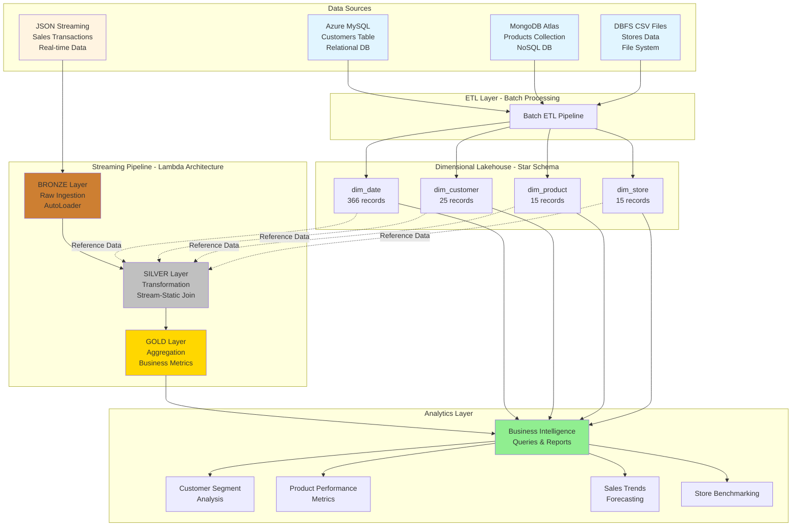

# Data Lakehouse Architecture Diagram



## Data Flow Explanation

### 1. Source Systems (Top Layer)
- **Azure MySQL:** Relational database containing customer information
- **MongoDB Atlas:** NoSQL database with product catalog
- **DBFS CSV:** Cloud file storage for store data
- **JSON Streaming:** Real-time sales transaction files

### 2. Batch ETL Pipeline
- Extracts data from 3 different source types
- Transforms data into dimensional format
- Loads into dimension tables

### 3. Dimensional Lakehouse (Star Schema)
- **dim_date:** Time dimension for temporal analysis
- **dim_customer:** Customer master data
- **dim_product:** Product catalog
- **dim_store:** Store locations and details
- All dimensions use surrogate keys

### 4. Streaming Pipeline (Bronze-Silver-Gold)

#### Bronze Layer
- Raw data ingestion using Spark AutoLoader
- Minimal transformation
- Preserves original source format
- Adds metadata (ingestion time, source file)

#### Silver Layer
- Data cleansing and validation
- **Key Feature:** Joins streaming fact data with static dimension data
- Enrichment with business attributes
- Type conversions and calculations

#### Gold Layer
- Business-level aggregations
- Pre-computed metrics
- Optimized for query performance
- Analytics-ready datasets

### 5. Analytics Layer
- SQL queries for business intelligence
- Customer segmentation
- Product performance analysis
- Sales trend forecasting
- Store benchmarking

## Lambda Architecture Pattern

This implementation follows the Lambda architecture:

```
Batch Layer (Dimensions)
    ↓
    └─→ Serving Layer (Star Schema) ←─┐
                                       │
Speed Layer (Streaming Facts) ────────┘
```

- **Batch Layer:** Processes historical dimension data
- **Speed Layer:** Handles real-time transaction data
- **Serving Layer:** Unified query interface combining both

## Technology Stack

| Component | Technology |
|-----------|-----------|
| Compute | Azure Databricks |
| Storage | Delta Lake |
| Streaming | Spark Structured Streaming |
| Batch Processing | PySpark |
| Data Format | Parquet (via Delta) |
| Schema | Star Schema (Kimball) |
| Ingestion | AutoLoader |

## Key Design Decisions

1. **Star Schema:** Optimized for analytical queries
2. **Delta Lake:** ACID transactions, time travel, schema evolution
3. **Bronze-Silver-Gold:** Progressive data refinement
4. **Stream-Static Join:** Real-time enrichment with reference data
5. **Surrogate Keys:** Better performance and flexibility
